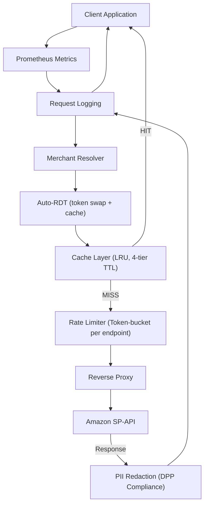

<p align="center">
  
</p>

<h1 align="center">Smart Proxy for SP-API</h1>

<p align="center">
  <strong>A reverse proxy that handles SP-API rate limits, caching, and PII redaction so your Amazon integrations stay fast and compliant.</strong>
</p>

<p align="center">
  Built by <a href="https://www.spiohq.com">SPIO</a> · Not affiliated with Amazon
</p>

<p align="center">
  <a href="https://github.com/spiohq/smart-proxy/actions/workflows/ci.yml"></a>
  <a href="https://goreportcard.com/report/github.com/spiohq/smart-proxy"></a>
  <a href="https://pkg.go.dev/github.com/spiohq/smart-proxy"></a>
  
  <a href="https://ghcr.io/spiohq/smart-proxy"></a>
  <a href="https://github.com/spiohq/smart-proxy/releases/latest"></a>
  <a href="LICENSE"></a>
</p>

---

## Table of Contents

- [Why Smart Proxy?](#why-smart-proxy)
- [Quick Start](#quick-start)
- [Usage](#usage)
- [Merchant ID](#merchant-id-important-for-caching--rate-limits)
- [Configuration](#configuration)
- [Architecture](#architecture)
- [Caching](#caching)
- [Rate Limiting](#rate-limiting)
- [Auto-RDT](#auto-rdt-restricted-data-token)
- [DPP Compliance & PII Redaction](#dpp-compliance--pii-redaction)
- [Dashboard](#dashboard)
- [Development](#development)
- [Documentation](#documentation)
- [Contributing](#contributing)
- [Community](#community)
- [Security](#security)
- [License](#license)

---

## Why Smart Proxy?

If you build on Amazon's Selling Partner API, you know the pain: aggressive rate limits, rotating access tokens that break caching, PII scattered across responses, and zero visibility into what's happening. Smart Proxy sits between your application and SP-API to solve all of that.

| Problem | Smart Proxy Solution |
|---|---|
| Redundant API calls waste quota and money | 4-tier LRU cache with automatic TTL eliminates duplicate GET and POST requests |
| Rate limits cause 429 errors and throttling | Token-bucket rate limiter with automatic queuing and priority lanes |
| PII handling is complex and error-prone | Built-in DPP-compliant PII redaction (REDACT / HASH / OMIT) |
| RDT management is tedious and error-prone | Auto-RDT minting with generic-path caching (one mint covers all orders) |
| No visibility into API usage | Request log browser with filters + Prometheus `/metrics` endpoint |
| Access tokens rotate hourly, breaking cache keys | Stable merchant-ID based caching across token rotations |
| Managing multiple SP-API regions | Single proxy with EU, NA, and FE on separate ports |

**Zero external dependencies.** Ships as a single static Go binary with embedded SQLite and SvelteKit dashboard.

---

## Quick Start

### Prerequisites

- **Docker** >= 20.10 (or **Go** >= 1.25 and **Node.js** >= 20 for source builds)

### 1. Docker Compose (recommended)

```bash
# Clone the repository
git clone https://github.com/spiohq/smart-proxy.git
cd smart-proxy

# Copy and adjust configuration
cp deploy/example.env .env

# Start the proxy
docker compose up -d
```

### 2. Docker Run

```bash
docker run -d \
  --name smart-proxy \
  --restart unless-stopped \
  -p 8080:8080 \
  -p 8081:8081 \
  -p 8082:8082 \
  -p 9090:9090 \
  -v sp-proxy-data:/data \
  ghcr.io/spiohq/smart-proxy:latest
```

### 3. Build from Source

```bash
make build       # Builds the Dashboard SPA + Go binary (embeds the SPA via go:embed)
./bin/smart-proxy
```

### Verify

Open [http://localhost:9090](http://localhost:9090) to access the dashboard, or:

```bash
curl -s http://localhost:8080/health
```

### Ports

| Port | Purpose |
|---|---|
| `8080` | EU region proxy -> `sellingpartnerapi-eu.amazon.com` |
| `8081` | NA region proxy -> `sellingpartnerapi.amazon.com` |
| `8082` | FE region proxy -> `sellingpartnerapi-fe.amazon.com` |
| `9090` | Dashboard (request logs, audit) |

> [!TIP]
> Set a port to `0` to disable a region: `-e SP_PROXY_PORT_FE=0`

---

## Usage

Point your SP-API client at the proxy instead of Amazon's endpoint:

```diff
- https://sellingpartnerapi-eu.amazon.com/orders/v0/orders
+ http://localhost:8080/orders/v0/orders
```

The proxy transparently forwards your request to Amazon, handling caching, rate limiting, and logging along the way. All SP-API authentication headers (`Authorization`, `x-amz-access-token`) are passed through unchanged.

### Request Headers

| Header | Description |
|---|---|
| `X-SP-Proxy-Merchant-Id: SELLER_XYZ` | **Recommended.** Stable merchant identifier for cache & rate limits |
| `X-SP-Proxy-No-Cache: true` | Bypass cache for this request |
| `X-SP-Proxy-Cache-TTL: 10m` | Override cache TTL for this request |
| `X-SP-Proxy-Cache-Until: 2025-01-01T00:00:00Z` | Cache until absolute time |
| `X-SP-Proxy-Throttle-Mode: reject` | Override rate-limit mode (`queue` / `reject` / `queue-timeout`) |
| `X-SP-Proxy-Priority: high` | Set queue priority (`low` / `normal` / `high`) |
| `X-SP-Proxy-Force-RDT: true` | Force RDT minting for this request (see [Auto-RDT](docs/RDT.md)) |

### Response Headers

| Header | Description |
|---|---|
| `X-SP-Proxy-Cache: HIT` / `MISS` / `PII_EXCLUDED` | Cache status |
| `X-SP-Proxy-Queued: true` | Request was queued due to rate limit |
| `X-SP-Proxy-Queue-Wait-Ms: 1200` | Time spent in queue (ms) |
| `X-SP-Proxy-Rate-Limit-Remaining: 0.5` | Remaining tokens in rate-limit bucket |

---

## Merchant ID: Important for Caching & Rate Limits

> [!IMPORTANT]
> **This is the single most impactful setting for cache and rate-limit efficiency.**

Send the `X-SP-Proxy-Merchant-Id` header with every request:

```bash
curl http://localhost:8080/orders/v0/orders \
  -H "X-Amz-Access-Token: Atza|..." \
  -H "X-SP-Proxy-Merchant-Id: MY_SELLER_ID"
```

### Why this matters

Without this header, the proxy falls back to a **SHA-256 hash of the access token** as merchant identifier. Since SP-API access tokens rotate every hour, this means:

- **Cache misses every hour.** The same data is fetched again after each token refresh because the cache key changes.
- **Rate-limit buckets reset every hour.** Token counters start from zero with each new token, losing burst capacity and risking 429s.

With `X-SP-Proxy-Merchant-Id`, the merchant identity stays **stable across token rotations**, giving you persistent cache hits, continuous rate-limit tracking, and per-seller isolation when managing multiple seller accounts.

### Resolution Priority

| Priority | Source | Example Key |
|---|---|---|
| 1 | `X-SP-Proxy-Merchant-Id` header | `MY_SELLER_ID` |
| 2 | Config-based token mapping | `mapped-seller-123` |
| 3 | SHA-256 hash of access token (fallback) | `tokenhash:a1b2c3d4e5f6...` |

---

## Configuration

All configuration is via environment variables. See [`deploy/example.env`](deploy/example.env) for the complete reference.

### Server

| Variable | Default | Description |
|---|---|---|
| `SP_PROXY_PORT_EU` | `8080` | EU region proxy port (`0` = disabled) |
| `SP_PROXY_PORT_NA` | `8081` | NA region proxy port (`0` = disabled) |
| `SP_PROXY_PORT_FE` | `8082` | FE region proxy port (`0` = disabled) |
| `SP_PROXY_PORT_DASHBOARD` | `9090` | Dashboard web UI port |
| `SP_PROXY_SHUTDOWN_TIMEOUT` | `30s` | Graceful shutdown timeout |

### Rate Limiting

| Variable | Default | Description |
|---|---|---|
| `SP_PROXY_RATELIMIT_ENABLED` | `true` | Enable rate limiting |
| `SP_PROXY_RATELIMIT_MODE` | `queue` | Default mode: `queue`, `reject`, `queue-timeout` |
| `SP_PROXY_RATELIMIT_QUEUE_TIMEOUT` | `60s` | Queue timeout (for `queue-timeout` mode) |
| `SP_PROXY_RATELIMIT_QUEUE_MAX_DEPTH` | `100` | Max queued requests per endpoint |
| `SP_PROXY_RATELIMIT_THROTTLE_FACTOR` | `0.8` | Safety margin (0.0-1.0) applied to published limits |
| `SP_PROXY_BUCKET_TTL` | `2h` | TTL for idle rate-limit buckets |

### Caching

| Variable | Default | Description |
|---|---|---|
| `SP_PROXY_CACHE_ENABLED` | `true` | Enable response caching |
| `SP_PROXY_CACHE_MAX_MEMORY` | `268435456` | Max cache memory in bytes (256 MB) |
| `SP_PROXY_CACHE_DEFAULT_TTL` | `60s` | Default cache TTL |
| `SP_PROXY_CACHE_EXCLUDE_PII` | `true` | Exclude PII-containing responses from cache |

### Auto-RDT

| Variable | Default | Description |
|---|---|---|
| `SP_PROXY_RDT_AUTO_MINT` | `false` | Enable automatic RDT minting for restricted PII endpoints |

### Storage & Retention

| Variable | Default | Description |
|---|---|---|
| `SP_PROXY_STORAGE_BACKEND` | `sqlite` | Metadata store backend |
| `SP_PROXY_SQLITE_PATH` | `/data/sp-proxy.db` | SQLite database path |
| `SP_PROXY_PURGE_METADATA_RETENTION` | `720h` | Request log retention (30 days) |
| `SP_PROXY_PURGE_AUDIT_RETENTION` | `8760h` | Audit log retention (365 days) |

### Body Storage

Request/response bodies live in hourly JSONL files on a three-tier path: the
active hour is written to local disk (`current/`), closed files are moved to
the configured backend (`recent/`), and older files are compressed and moved
again (`archive/`). Headers live next to the payload in the same JSONL entry.

| Variable | Default | Description |
|---|---|---|
| `SP_PROXY_BODIES_ENABLED` | `true` | Enable request/response body storage |
| `SP_PROXY_BODIES_PATH` | `/data/bodies` | Local body storage root; always holds the active hour |
| `SP_PROXY_BODIES_BACKEND` | `local` | Backend for `recent/` and `archive/`: `local` or `s3` |
| `SP_PROXY_BODIES_RECENT_MAX_AGE` | `24h` | Age at which files leave `recent/` for `archive/` |
| `SP_PROXY_BODIES_ARCHIVE_MAX_AGE` | `720h` | Age at which files are purged from `archive/` (30 days) |
| `SP_PROXY_BODIES_COMPRESSION` | `zstd` | Archive codec: `zstd`, `gzip`, or `none` |
| `SP_PROXY_BODIES_MAX_CAPTURE_SIZE` | `262144` | Per-message byte cap for captured bodies (256 KiB) |
| `SP_PROXY_BODIES_MAX_BYTES` | `8589934592` | Hard cap across all tiers (8 GiB); `0` disables size eviction |

### S3 Backend

Only read when `SP_PROXY_BODIES_BACKEND=s3`. Compatible with AWS S3, MinIO,
Cloudflare R2, and any other S3-compatible object store.

| Variable | Default | Description |
|---|---|---|
| `SP_PROXY_S3_BUCKET` | | Bucket name |
| `SP_PROXY_S3_REGION` | | AWS region (any non-empty value for non-AWS backends) |
| `SP_PROXY_S3_ENDPOINT` | | Custom endpoint URL; leave blank for AWS S3 |
| `SP_PROXY_S3_ACCESS_KEY` | | Access key; if blank, the default AWS credential chain is used |
| `SP_PROXY_S3_SECRET_KEY` | | Secret key |
| `SP_PROXY_S3_PATH_STYLE` | `false` | Set `true` for MinIO and some on-prem providers |

---

## Architecture



### Middleware Pipeline

Every request passes through the middleware stack in order: Prometheus metrics collection, request/response logging, merchant identity resolution, Auto-RDT token handling (if enabled), cache lookup, rate limiting, and finally the reverse proxy to Amazon. Responses flow back through the same stack, with PII redaction applied before logging and caching.

### Tech Stack

| Layer | Technology |
|---|---|
| **Backend** | Go 1.25, single static binary, no CGO |
| **Database** | SQLite via `modernc.org/sqlite` (pure Go) |
| **Dashboard** | SvelteKit 2, Svelte 5, TailwindCSS |
| **Metrics** | Prometheus client library |
| **Container** | Alpine 3.21, multi-stage Docker build |

---

## Caching

Smart Proxy uses a **4-tier LRU in-memory cache** designed for SP-API's specific access patterns:

- **Automatic TTL management** based on endpoint type. Catalog data gets longer TTLs, order data gets shorter ones.
- **PII-aware caching.** Responses containing PII are excluded from cache by default (`SP_PROXY_CACHE_EXCLUDE_PII=true`) to maintain DPP compliance.
- **Merchant-scoped cache keys.** Each seller gets isolated cache entries, preventing data leakage between accounts.
- **POST body caching.** Read-only POST endpoints (batch queries, fee estimates, shipping rates) are cached using body-hash or per-element strategies. Batch endpoints like `getItemOffersBatch` cache each element individually, so overlapping batches share cache entries across requests.
- **Per-request overrides.** Use `X-SP-Proxy-No-Cache`, `X-SP-Proxy-Cache-TTL`, or `X-SP-Proxy-Cache-Until` headers for fine-grained control.

For full details on cache tiers, POST caching strategies, invalidation, and tuning, see [docs/CACHING.md](docs/CACHING.md).

---

## Rate Limiting

The built-in rate limiter uses **per-endpoint token buckets** that mirror SP-API's published rate limits:

- **Three operating modes:** `queue` (wait for tokens), `reject` (return 429 immediately), and `queue-timeout` (wait up to N seconds, then 429).
- **Priority queuing.** Mark critical requests as `high` priority via `X-SP-Proxy-Priority` header to jump the queue.
- **Throttle factor.** Apply a configurable safety margin (default 0.8x) to stay within limits even under burst conditions.
- **Stable bucket tracking.** When combined with `X-SP-Proxy-Merchant-Id`, buckets persist across token rotations instead of resetting every hour.

For the full rate-limit reference and per-endpoint defaults, see [docs/RATE_LIMITING.md](docs/RATE_LIMITING.md).

---

## Auto-RDT (Restricted Data Token)

Many SP-API endpoints that return PII (buyer info, shipping addresses, tax data) require a Restricted Data Token instead of a regular access token. Smart Proxy can handle this automatically:

- **Automatic detection.** The proxy knows which endpoints need RDTs and mints them on-the-fly using the client's LWA token.
- **Generic-path caching.** One RDT mint covers all requests to the same operation class (e.g., all order GETs) for 55 minutes. Cache hit rate after the first mint approaches 100%.
- **Singleflight deduplication.** Concurrent requests for the same operation trigger only one upstream mint call.
- **Report-aware.** The proxy tracks the report lifecycle to determine which document downloads need RDTs and which don't.
- **Per-request override.** Use `X-SP-Proxy-Force-RDT: true` to force-mint (useful for report documents from notifications) or `false` to skip minting.
- **Fail-open.** If minting fails, the original request is forwarded unchanged.

For the full reference, covered endpoints, and report handling details, see [docs/RDT.md](docs/RDT.md).

---

## DPP Compliance & PII Redaction

Smart Proxy includes built-in detection and redaction of personally identifiable information (PII) to help you comply with Amazon's [Data Protection Policy (DPP)](https://developer-docs.amazon.com/sp-api/docs/data-protection-policy):

- **Three redaction modes:** `REDACT` (replace with placeholder), `HASH` (one-way SHA-256), `OMIT` (remove field entirely).
- **Applied to logs and cache.** PII is redacted before data hits SQLite or the request body storage.
- **Configurable per field.** Define which fields to redact and which mode to use.

For configuration details, field mappings, and compliance guidance, see [docs/DPP_COMPLIANCE.md](docs/DPP_COMPLIANCE.md).

---

## Dashboard

Smart Proxy ships with a **built-in SvelteKit dashboard** on port `9090` for inspecting API traffic:

- **Request Log Browser** with filtering by merchant, region, endpoint, status code, cache status, HTTP method, latency range, and time range
- **Request Detail View** with headers, query parameters, and request/response bodies
- **Audit Log** for system-wide configuration and security events
- **Prometheus-compatible `/metrics` endpoint** for integration with Grafana, Alertmanager, or any Prometheus-based monitoring stack

> [!NOTE]
> The dashboard SPA is embedded into the Go binary at compile time via `go:embed`. Running `make build` automatically rebuilds the SPA from `web/` before compiling the Go binary.

---

## Development

### Local Dev with Docker (recommended)

```bash
# Install frontend dependencies (first time only)
cd web && npm install && cd ..

# Build SPA + Docker image and start the container
make dev
```

This uses `docker-compose.dev.yml`, which builds the image from your local source instead of pulling from GHCR.

### Manual Build

```bash
cd web && npm install && cd ..   # Frontend deps (first time only)
make build                       # Build Dashboard SPA + Go binary (embeds the SPA)
./bin/smart-proxy                # Run locally
```

### Testing

```bash
make test       # Unit tests with race detection
make e2e-test   # End-to-end tests
make lint       # Run golangci-lint
```

### Other Commands

```bash
make docker-build   # Build Docker image (includes SPA rebuild)
make clean          # Clean build artifacts
```

---

## Documentation

| Document | Description |
|---|---|
| [Caching](docs/CACHING.md) | Cache tiers, TTL strategies, invalidation |
| [Rate Limiting](docs/RATE_LIMITING.md) | Token buckets, per-endpoint defaults, modes |
| [Auto-RDT](docs/RDT.md) | Automatic RDT minting, caching, report handling |
| [DPP Compliance](docs/DPP_COMPLIANCE.md) | PII redaction configuration, field mappings |
| [Library Integrations](docs/libraries/) | Guides for popular SP-API client libraries |

---

## Contributing

Contributions are welcome! Bug reports, feature requests, documentation improvements, and code all help make the project better.

Please read [CONTRIBUTING.md](CONTRIBUTING.md) before submitting a pull request. It covers the development setup, coding conventions, commit message format, and the review process.

If you're looking for a good first contribution, check the issues labeled [`good first issue`](https://github.com/spiohq/smart-proxy/issues?q=is%3Aissue+is%3Aopen+label%3A%22good+first+issue%22).

---

## Community

**[spiohq.com](https://spiohq.com)** is an independent community for SP-API developers and integrators. We are not affiliated with Amazon.

Whether you're building a private-label tool, an agency integration, or a full SaaS product on top of SP-API, join us to share knowledge, discuss best practices, and stay ahead of API changes.

---

## Security

If you discover a security vulnerability, please report it responsibly. See [SECURITY.md](SECURITY.md) for our disclosure policy and contact information.

**Do not open public GitHub issues for security vulnerabilities.**

---

## License

This project is licensed under the [GNU Affero General Public License v3.0 (AGPL-3.0)](LICENSE).

**What this means in practice:** You are free to use, modify, and distribute this software. If you modify Smart Proxy and make it available to users over a network (e.g., as part of a SaaS product), you must make your modified source code available under the same license to those users.

Using Smart Proxy as-is (without modification) to proxy your own SP-API requests does not trigger any source-sharing obligations.

For commercial licensing options that don't require AGPL compliance, contact [licensing@spiohq.com](mailto:licensing@spiohq.com).